Vulkan Path Tracer
================

**University of Pennsylvania, CIS 565: GPU Programming and Architecture, Project 2**

* Nathan Chortek
  * [LinkedIn](https://www.linkedin.com/in/nathan-chortek/), [personal website](https://www.nathanchortek.com/)
* Tested on: Windows 11, AMD Ryzen AI 9 HX 370, NVIDIA GeForce RTX 5090 Laptop GPU

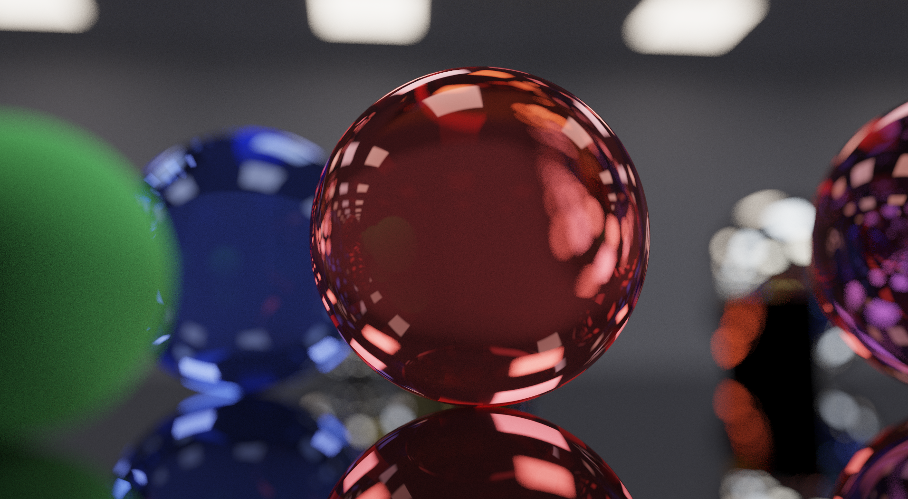

## Build Instructions

### Requirements

- Windows with Visual Studio and CMake 3.24+
- A GPU and driver supporting Vulkan 1.3 with `VK_KHR_acceleration_structure` and `VK_KHR_ray_tracing_pipeline`
- The [Vulkan SDK](https://vulkan.lunarg.com/) (tested with 1.4.328). Its installer sets the `VULKAN_SDK` environment variable, which CMake uses to find the Vulkan headers and the `glslc` shader compiler. No other environment variables are needed.

All other dependencies are vendored in `external/` (versions in `external/VERSIONS.md`): volk, vk-bootstrap, Vulkan Memory Allocator, Dear ImGui, GLFW, GLM, nlohmann/json and stb.

### CMake changes

- CUDA is removed entirely; the project is plain C/C++17 and links against the vendored libraries above.
- Vulkan is loaded at runtime through volk, so only the Vulkan headers are needed at build time.
- Shaders in `shaders/` are compiled from GLSL to SPIR-V by `glslc` as part of the build. Include dependencies are tracked, so editing a shared `.glsl` file or `src/gpu/shared.h` recompiles every shader that uses it. The output directory is compiled into the executable, so shaders are found regardless of working directory.
- The Visual Studio debugger is preconfigured to run from the repository root with `scenes/cornellGlassSphere.json` as the default scene.

### Building and running

    cmake -B build
    cmake --build build --config Release

The scene file is the program's only argument. To change it in Visual Studio, open the project's 
**Properties --> Configuration Properties --> Debugging** and edit **Command Arguments** (e.g. 
`scenes/funhouseClosed.json`). Alternatively, run the executable from the repository root:

    build\bin\Release\cis565_path_tracer.exe scenes\crystalTable.json

## Features Implemented

### Vulkan Hardware-Accelerated Ray Tracing (RT)

The path tracer is built on the Vulkan ray tracing pipeline rather than CUDA kernels, so ray-scene 
intersection runs on the GPU's dedicated ray tracing hardware.

**Acceleration structures.** Each unique mesh gets one bottom-level acceleration structure (BLAS) 
holding its triangles. A single top-level acceleration structure (TLAS) holds one instance per scene 
object, each pairing a BLAS with that object's transform. Objects that share a mesh share a BLAS, 
and each instance carries an index into a geometry table so that they can still use different materials.

**Shaders.** The pipeline has three shaders, each with one record in the shader binding table (SBT), 
which is how the pipeline finds the shader to run for a given ray:

- **Raygen** runs once per pixel and owns the entire path: it generates the camera ray, runs the integrator loop, accumulates the result, and writes the tone-mapped display image. Bounces are iterated in a loop, so the pipeline's recursion depth is 1.
- **Closest hit** does no shading. It fetches the hit triangle's vertices, interpolates position, normals and UVs, and returns them with the material index in the ray payload.
- **Miss** marks the payload as a miss. Shadow rays skip the closest-hit shader and stop at the first hit, so for them this is the only shader that runs.

**Reducing per-frame overhead.** Everything that changes per frame (e.g. camera, frame count, max depth, 
feature flags) is passed as an 80-byte push constant block, so no uniform buffers or descriptor sets 
are updated between frames. Scene data (e.g. vertices, indices, geometry table, materials, lights) is reached 
through buffer device addresses: the push constants carry one 64-bit address of a small buffer that 
holds the addresses of the rest. The descriptor set contains only the TLAS and the two output images.

**Performance impact.** Hardware traversal replaces a brute-force intersection test against every object 
with a driver-built BVH, so cost grows roughly logarithmically with triangle count. Because each path runs 
to completion inside one raygen invocation, there is no path state to store between bounces and no stream 
compaction or material sorting pass. At 1920x1080 with a maximum depth of 16, the test scenes run between 
114 and 713 FPS (one sample per pixel per frame).

**Compared to a CPU implementation.** Path tracing benefits heavily from the GPU: every pixel's path is 
independent, and a 1080p frame is about two million of them. A CPU would trace them on a few dozen threads 
with software BVH traversal, while the GPU runs them in parallel with traversal and triangle intersection 
handled by hardware built for that purpose.

**Future optimization.** After the first bounce, neighboring pixels hit different materials and take different 
branches, which hurts GPU efficiency. Shader execution reordering (SER) would help address this by letting raygen 
regroup rays by a hint, such as material type, before shading. The application already detects and enables 
`VK_NV_ray_tracing_invocation_reorder` when the device supports it, but the shaders do not utilize it yet.

### Refraction & Dielectric Materials

Cornell Box (Open) w/ Diffuse Materials, 5000 Iterations, Max Depth 16

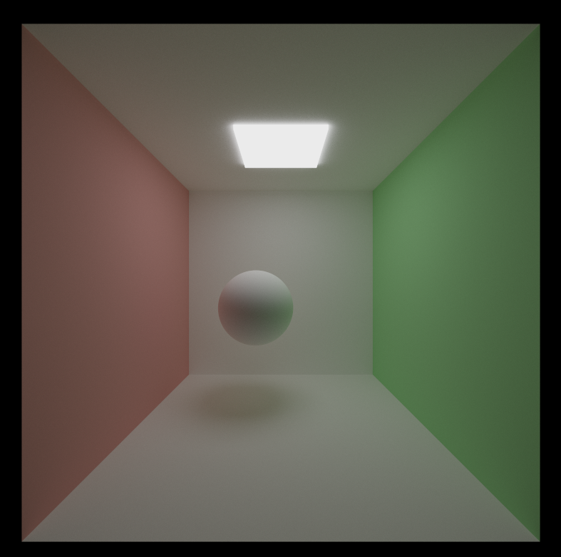

Cornell Box (Open) w/ Glass Sphere and Mirror Wall, 5000 Iterations, Max Depth 16

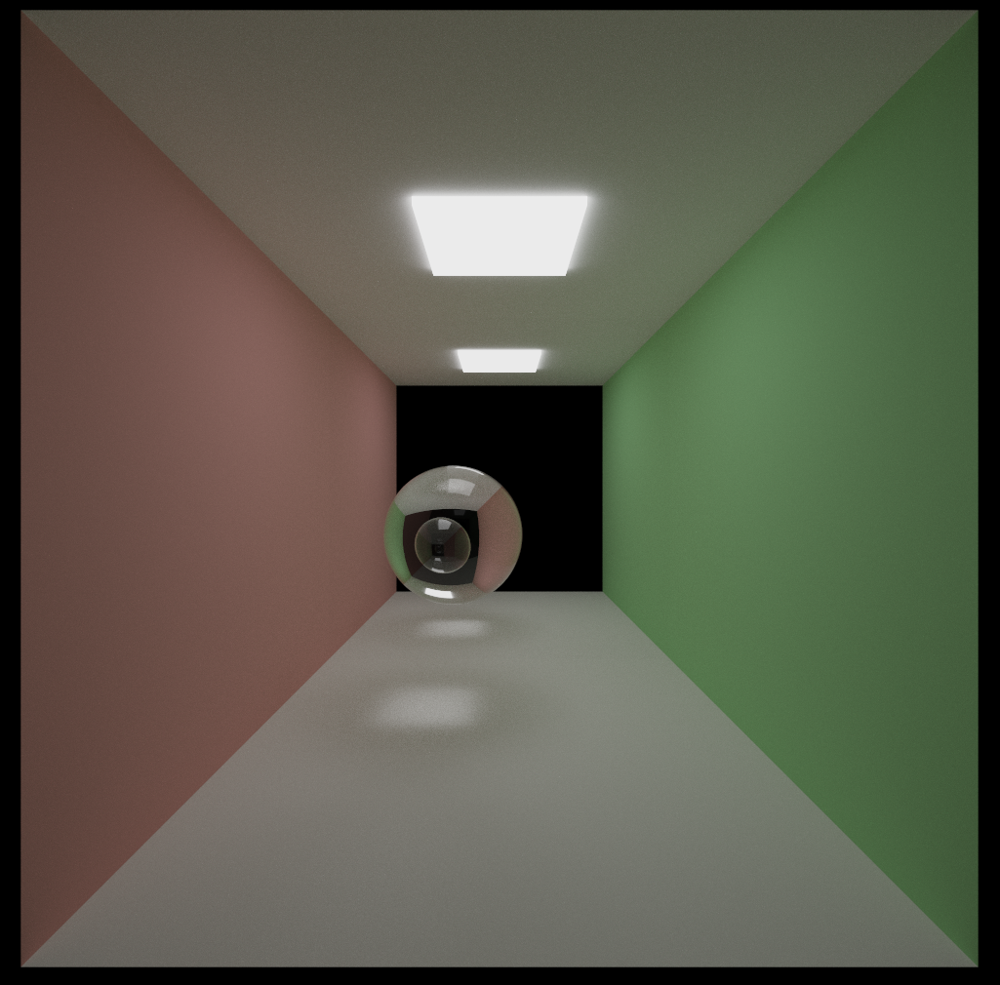

Glass is modeled as a combination of perfect specular reflection and perfect specular transmission. At each hit, 
one of the two is chosen with equal probability and its contribution is doubled to compensate. The result is weighted 
by the Fresnel reflectance for dielectrics, so glass reflects more at grazing angles and transmits more when viewed 
head-on.

Transmitted rays are bent according to Snell's law using the material's index of refraction, which is set per material 
in the scene file. Whether a ray is entering or leaving the object is determined from which side of the surface it arrives 
on, and total internal reflection is handled when a ray inside the glass cannot exit. The material's color tints the light 
passing through, which produces the colored glass in the Funhouse and Crystal Table scenes.

### Physically-Based Depth-of-Field (DOF)

Funhouse (Open) w/o DOF, 5000 Iterations, Max Depth 16

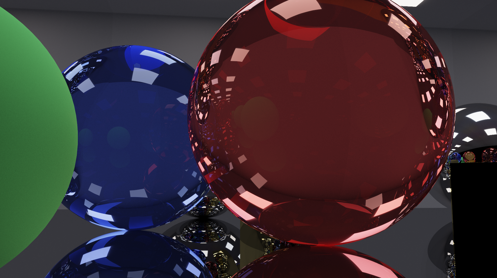

Funhouse (Open) w/ DOF, 5000 Iterations, Max Depth 16

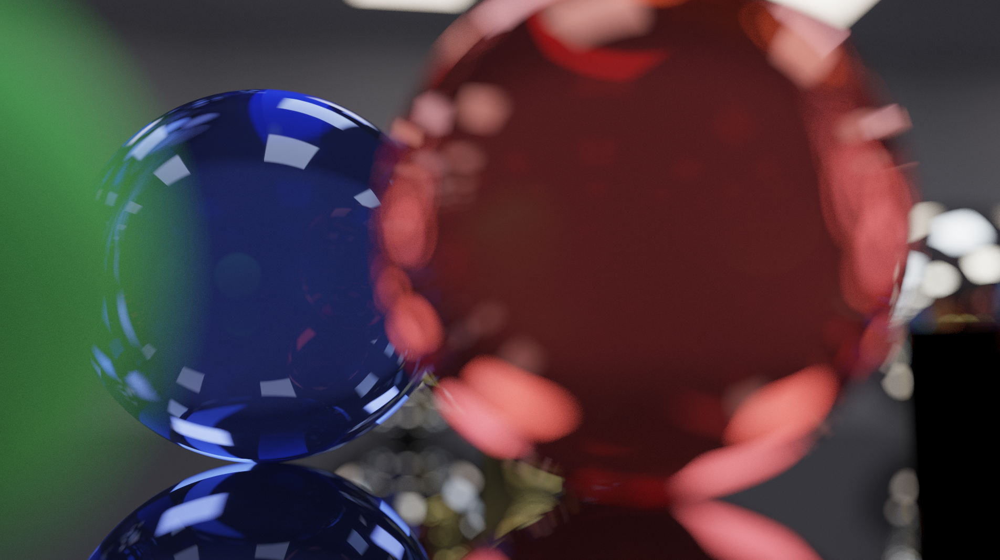

Depth of field uses a thin-lens camera model in place of the default pinhole. For each camera ray, the point where the 
pinhole ray crosses the focal plane is computed first. The ray origin is then moved to a random point on a circular lens, 
and the ray is re-aimed at that focal point.

Objects at the focal distance stay sharp because every lens sample converges on the same point, while objects nearer or 
farther are blurred in proportion to their distance from the focal plane. Averaging over many iterations produces the 
smooth blur shown above. The lens radius and focal distance are constants in the raygen shader, and the effect can be 
toggled at runtime from the GUI.

### Direct Lighting & Multiple Importance Sampling (MIS)

Crystal Table (Open), Naive Integration, 5000 Iterations, Max Depth 16

Crystal Table (Open), MIS Integration, 5000 Iterations, Max Depth 16

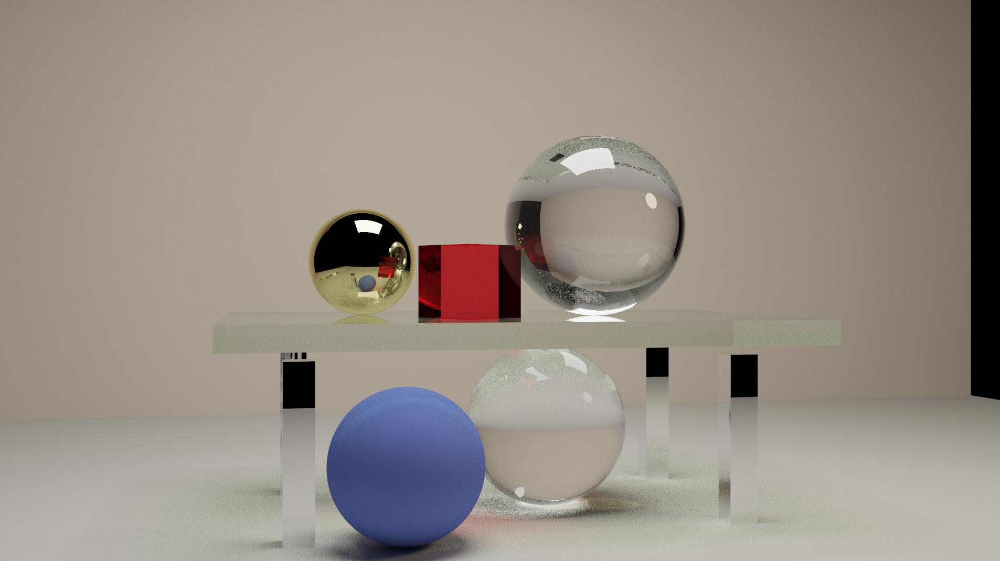

Crystal Table (Closed), Naive Integration, 5000 Iterations, Max Depth 16

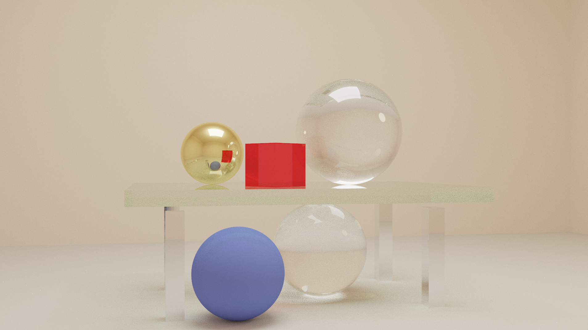

Crystal Table (Closed), MIS Integration, 5000 Iterations, Max Depth 16

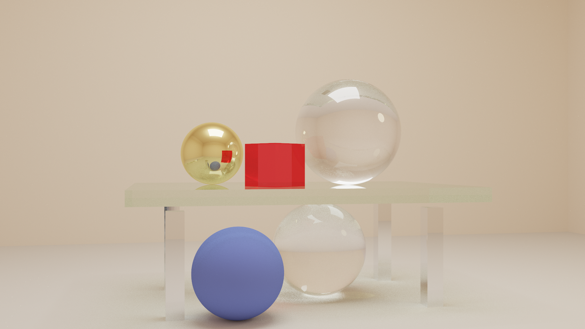

Funhouse (Open), Naive Integration, 5000 Iterations, Max Depth 16

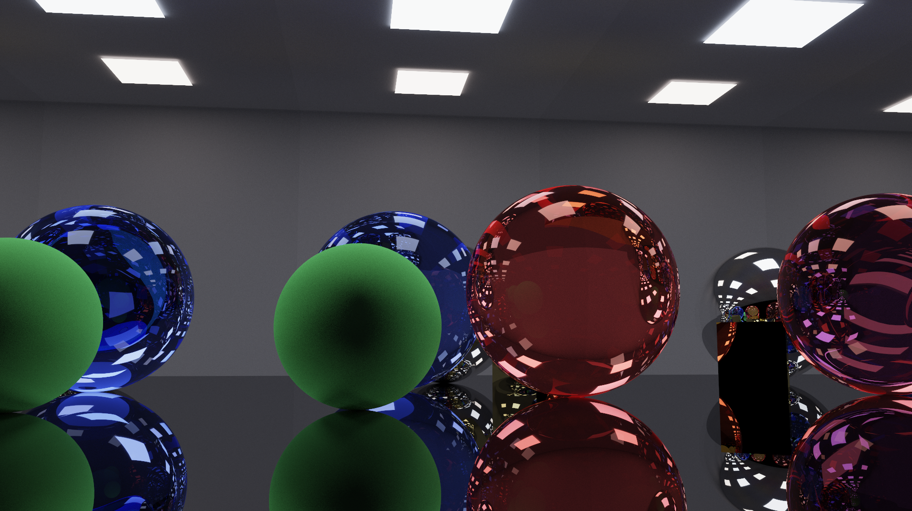

Funhouse (Open), MIS Integration, 5000 Iterations, Max Depth 16

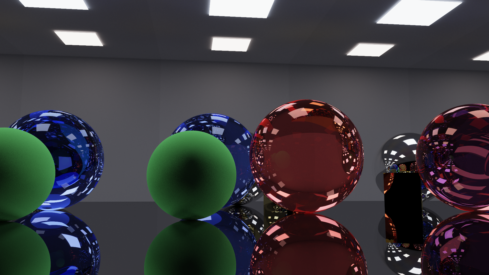

Funhouse (Closed), Naive Integration, 5000 Iterations, Max Depth 16

Funhouse (Closed), MIS Integration, 5000 Iterations, Max Depth 16

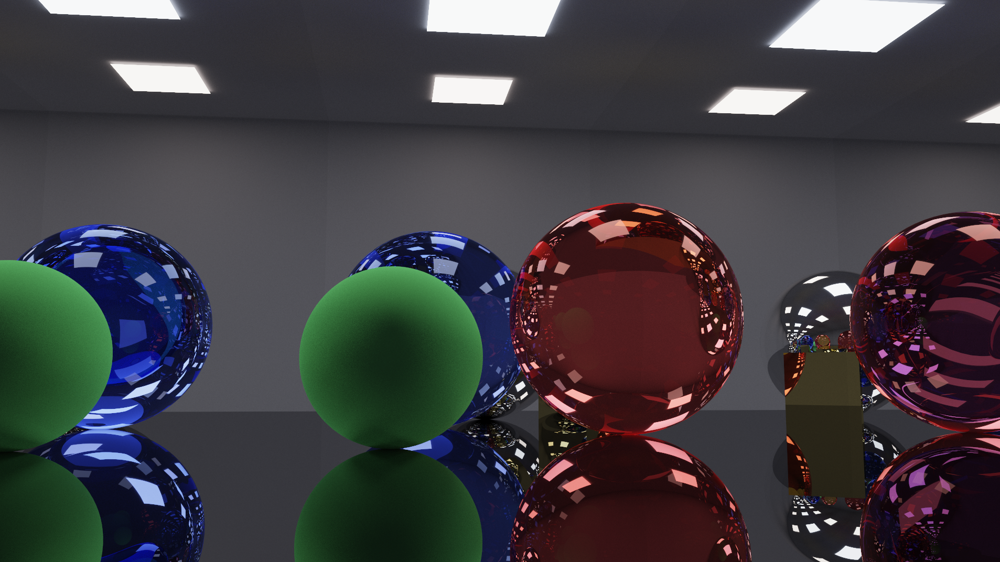

**Direct light sampling.** In naive path tracing, a path contributes light only if it happens to hit an emitter before 
it terminates. Most paths do not (especially when lights are small) so most samples are black which produces a noisy image. 
Direct light sampling fixes this by deliberately connecting to a light at every non-specular bounce: it picks a point 
on a random light, traces a shadow ray to check visibility, and adds that light's contribution to the current bounce.

**Choosing a light sample.** At load time, every triangle of every emissive object is collected into a list with its 
world-space area, along with a cumulative distribution function (CDF) over those areas. To sample, a uniformly random 
number is binary-searched against the CDF, which selects a triangle with probability proportional to its area, and a 
uniformly random point is then chosen on that triangle. Together this samples all emissive surface area uniformly. 
The corresponding probability density function (PDF) is one over the total light area, converted to solid angle using 
the distance to the light and the angle at which the light faces the surface.

**Multiple importance sampling.** Light sampling and BSDF sampling each perform poorly in different situations. Light 
sampling works well for small lights on diffuse surfaces but poorly when a light is large or close. BSDF sampling is the 
opposite, and for purely specular surfaces it is the only option. Rather than picking one, MIS uses both at every bounce 
and  weights each by the power heuristic, which favors whichever strategy was more likely to produce that direction. This 
keeps the strengths of both sampling methods without counting any light twice. After a specular bounce, light sampling is 
not possible, so emitted light is counted in full.

**Open vs. closed scenes.** MIS reduces noise in every scene, but the improvement over naive is largest in the open 
scenes. There, most naive paths escape the scene after a bounce or two without reaching a light, so nearly all of the 
image's energy comes from a small fraction of samples. MIS recovers a lighting contribution at every diffuse bounce 
regardless of where the path goes next. In the closed scenes, paths cannot escape and keep bouncing until they hit a 
light or reach the maximum depth, so naive paths find a light far more often and start from a lower noise level. MIS 
still helps in such cases, but there is less to gain.

## Performance Analysis

### MIS vs. Naive Path Tracing

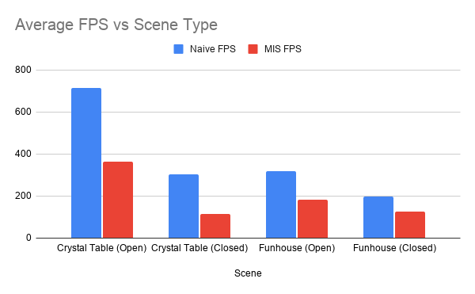

| Scene | Naive FPS | MIS FPS |
| --- | --- | --- |
| Crystal Table (Open) | 713.1 | 362.6 |
| Crystal Table (Closed) | 303.4 | 114.2 |
| Funhouse (Open) | 317.6 | 183.7 |
| Funhouse (Closed) | 199.3 | 127.1 |

Frame time is largely driven by the number of rays traced per path, and two factors change that number:

**Open vs. closed.** In an open scene, a ray that does not intersect any geometry immediately terminates its path. 
In a closed scene, every ray is guaranteed to intersect some geometry, so their paths continue until they hit a 
light or reach the maximum depth of 16. Closing the scene makes every configuration slower, because there are more 
rays being traced per path. The effect is strongest in the Crystal Table scene (2.4x slower for Naive, 3.2x for MIS), 
because its open version is only a floor and one wall, and most paths exit the scene almost immediately. The Funhouse 
scene is a corridor that is open at just one end, so its paths were already long, and closing it costs less (1.6x for 
Naive, 1.4x for MIS).

**Naive vs. MIS.** MIS traces an additional shadow ray at every non-specular bounce and evaluates the BSDF a second 
time, so it runs at roughly 40-65% of the naive frame rate. The penalty is largest in the closed Crystal Table scene, 
where the added walls are all diffuse and nearly every bounce triggers a shadow ray. It is smaller in the Funhouse scene, 
where the many of the materials are purely specular and therefore skip light sampling. Overall, MIS is slower per frame, 
but each frame carries far less noise, so it reaches a cleaner image in fewer iterations.

## References

### Articles

https://www.willusher.io/graphics/2019/11/20/the-sbt-three-ways/

https://developer.nvidia.com/blog/vulkan-raytracing/

### Tutorials

https://vulkan-tutorial.com/

https://nvpro-samples.github.io/vk_raytracing_tutorial_KHR/tutorial/

### Other CIS Courses

#### CIS 5660 Procedural Graphics

cube.h, icosphere.h - Primitive mesh generators adapted from *HW 0: Intro to Javascript and WebGL*

https://github.com/nchortek/hw00-intro-base/blob/main/src/geometry/Cube.ts
https://github.com/nchortek/hw00-intro-base/blob/main/src/geometry/Icosphere.ts

#### CIS 5610 Advanced Rendering

bsdf.glsl, math.glsl, raygen.rgen, sampleWarping.glsl - BSDF, sampling, and integrator logic adapted from *HW7: Global Illumination*
